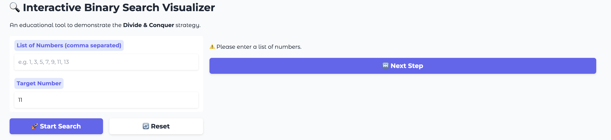

# Interactive Binary Search Visualizer

**Course:** CISC Project
**Author:** [Your Name Here]

---

## 🚀 App Demo
Here is the application in action, demonstrating the "Divide and Conquer" strategy.

### 1. Working Algorithm (Success Case)
The visualization below shows the algorithm finding the number **11**. Note how the "discarded" elements turn grey while the active search space remains white.


### 2. Error Handling & Edge Cases
The application is robust against invalid inputs. As shown below, trying to start a search with empty input triggers a warning instead of crashing the program.


---

## 1. Choose an Algorithm
For this project, I have selected **Binary Search** to demonstrate the "divide and conquer" strategy. Unlike Linear Search, which processes data sequentially in $O(n)$ time, Binary Search demonstrates the power of logarithmic time complexity $O(\log n)$ by exponentially reducing the search space. I chose this algorithm because it is the ideal candidate for a **visual educational tool**: the mechanism of discarding half the dataset at every step provides immediate, distinct visual feedback. This allows the learner to physically see the efficiency of the algorithm in real-time. Furthermore, Binary Search is a foundational algorithm used widely in real-world systems, such as database indexing and dictionary lookups, making it a practical choice for connecting theory to application.

---

## 2. Plan Using Computational Thinking

### Decomposition
To transform the abstract concept of Binary Search into a working application, I applied decomposition to break the problem into five distinct stages.
1.  **Validation Stage:** Ensure the user's input is a valid list of numbers and is sorted (a prerequisite for Binary Search).
2.  **Initialization Stage:** Set the distinct pointers `low`, `high`, and `mid` and store them in a persistent state.
3.  **Calculation Stage:** Compute the midpoint index dynamically: `(low + high) // 2`.
4.  **Comparison Stage:** Compare the value at the midpoint against the user's target value.
5.  **State Update/Termination:** Based on the comparison, either identify the target or discard the irrelevant half of the list by updating the `low` or `high` pointers.

### Pattern Recognition
The core pattern of this algorithm is a repetitive **Comparison Loop** that does not change regardless of the dataset size. I identified that the algorithm relies on a single, repeatable action: calculate mid, compare, and discard. Recognizing this pattern allows the application to use a standard state-preserving loop structure. Whether the list has ten numbers or ten thousand, the application applies this exact same logic pattern until the target is found or the search space is exhausted.

```mermaid
flowchart TD
    A[Start] --> B[/Input List & Target/]
    B --> C[Validation & Sort]
    C --> D[Init: Low=0, High=n-1]
    D --> E{Low <= High?}
    E -- No --> F[End: Not Found]
    E -- Yes --> G[Calc Mid]
    G --> H{Arr[Mid] == Target?}
    H -- Yes --> I[End: Found Match!]
    H -- No --> J{Arr[Mid] < Target?}
    J -- Yes --> K[Low = Mid + 1]
    J -- No --> L[High = Mid - 1]
    K --> E
    L --> E
```
*(Figure 1: The repeatable pattern of Binary Search)*

### Abstraction
To meet the **educational goals** of the project, I utilized abstraction to filter out unnecessary complexity. While the underlying Python code manages memory allocation, string parsing, and error handling, these details are hidden from the interface. The user is presented only with the essential model: the list indices, the values, and the changing state of the search zone. Crucially, the interface abstracts the logical decision-making into simple text feedback (e.g., *"Target is smaller than Midpoint, so we ignore the right side"*), allowing the user to focus entirely on the algorithmic behavior rather than the code syntax.

### Algorithm Design
The design follows a strict **Input $\to$ Process $\to$ Output** workflow tailored for a Graphical User Interface.
* **Input:** The user enters a comma-separated string of numbers and a target integer. The interface includes specific controls: **"Start Search"** to initialize the data, **"Next Step"** to advance the iteration, and **"Reset"** to clear the state.
* **Process:** The application uses a state-machine approach (`gr.State`) to remember the `low`, `high`, and `mid` indices between interactions, ensuring the app does not "forget" its place after every button click.
* **Output:** The sorted list is displayed as a dynamic visual grid where the process is visualized through color changes: **Green** indicates the target is found, **Yellow** highlights the current midpoint, and **Grey** signifies sections of the list that have been logically eliminated.

---

## 3. Steps to Run the App

1.  **Clone the Repository** (or download the files).
2.  **Install Dependencies:**
    ```bash
    pip install -r requirements.txt
    ```
3.  **Run the Application:**
    ```bash
    python app.py
    ```
4.  **Open in Browser:**
    Click the link provided in the terminal (usually `http://127.0.0.1:7860`).

---

## 4. Live Demo (Hugging Face)
The application is deployed live and can be tested here:
**[LINK TO YOUR HUGGING FACE APP HERE]**

---

## 5. Acknowledgments
* **Gradio Documentation:** For the `gr.State` implementation guide.
* **CISC Course Notes:** For the Binary Search complexity analysis.
